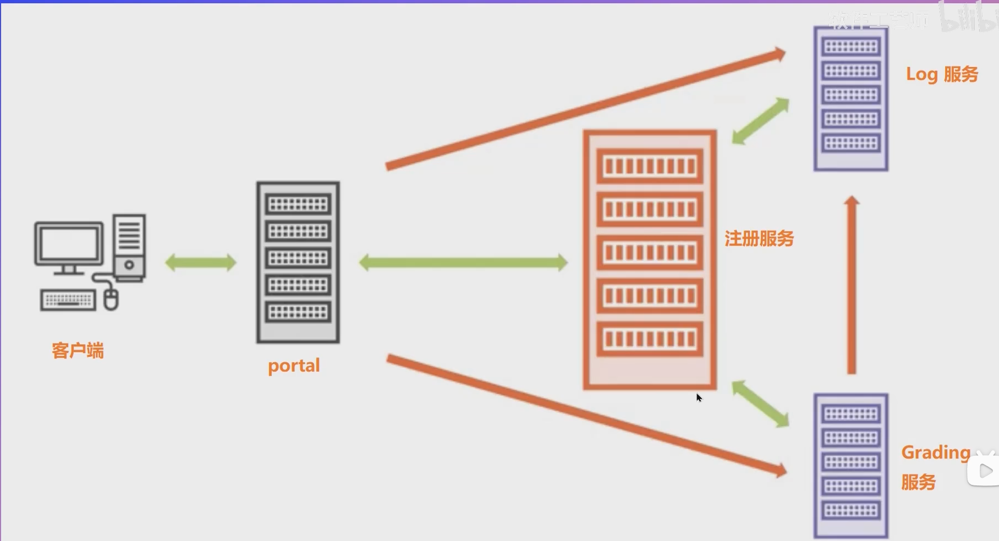

### Go语言编写简单分布式系统

- 是看这个写的 [Go语言编写简单分布式系统](https://www.bilibili.com/video/BV1ZU4y1577q?p=15&vd_source=7c0892485e4b2ae87d30238c61ca2c86)
- 软件架构如下
 
  - portal，是web服务，他依赖于log服务，Grading服务。
  - log服务，简单实现http 写日志api。
  - Grading是一个学生成绩查询http服务，数据写死在文件中。
  - 注册服务（服务中心），所有服务启动时都会请求该服务，把url，服务名记录在注册服务中心，当服务a状态发生变更，服务中心遍历所有注册的服务，通过http请求通知依赖服务a的服务，a已经挂了
- 启动
  - `go run part2_distributed/cmd/registryservice/main.go`，启动服务中心
  - `go run part2_distributed/cmd/logservice/main.go`，启动日志服务
  - `go run part2_distributed/cmd/gradingservice/main.go`，启动学生信息服务
  - `go run part2_distributed/cmd/portal/main.go`，启动学信信息web