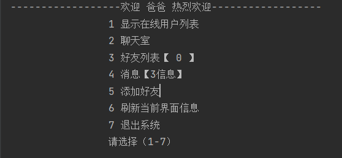

## consoleChat
基于go的控制台聊天

## 目录结构
客户端入口文件 client/main.go
服务端入口文件 server/main.go
配置文件config/config.toml

## 依赖
redis(配置在/library/config/toml.go)
nsq(代码写死集群/server/service/nsq.go)

## 启动

服务端 `go run server/main.go`

客户端` go run client/main.go`

